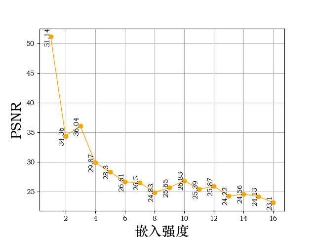
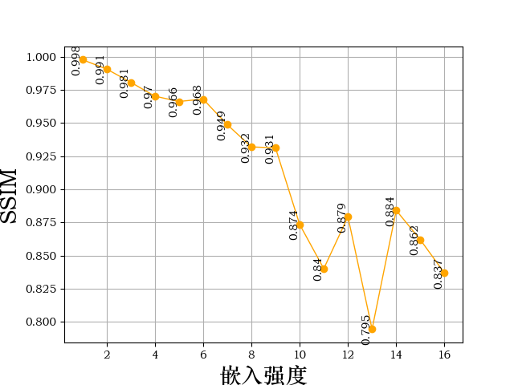
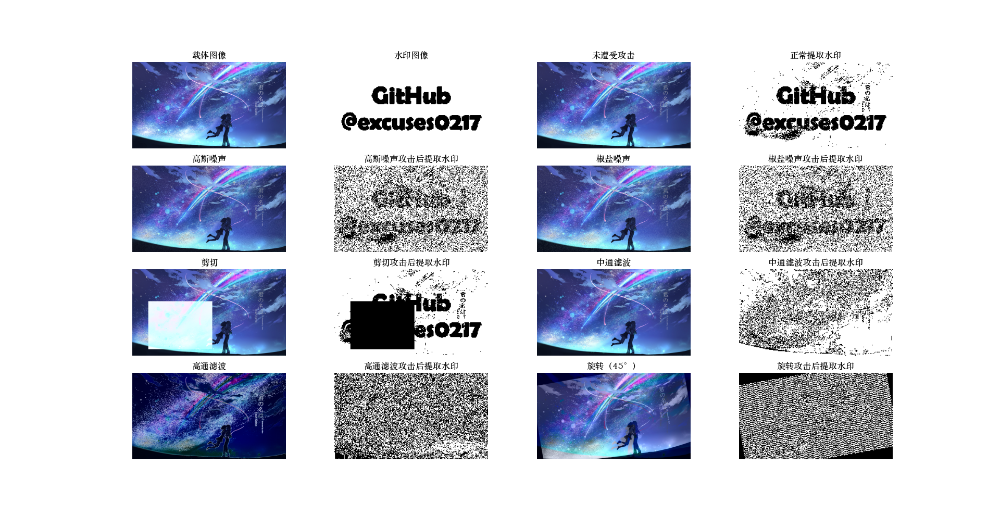
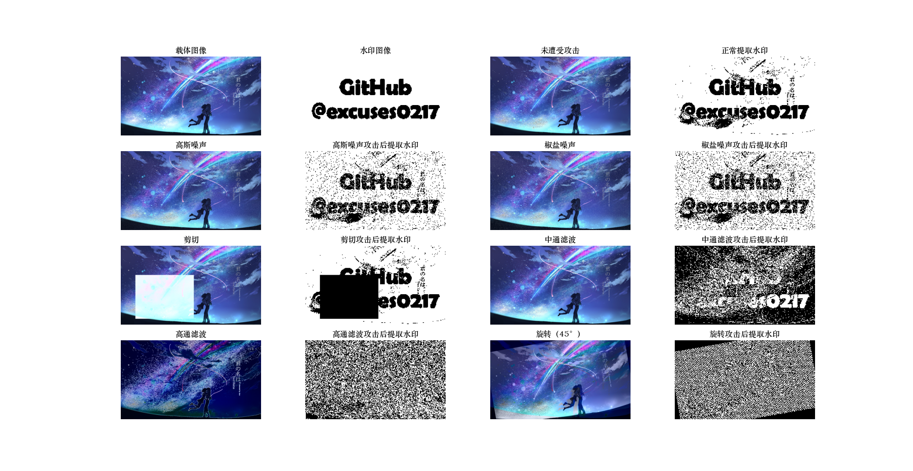
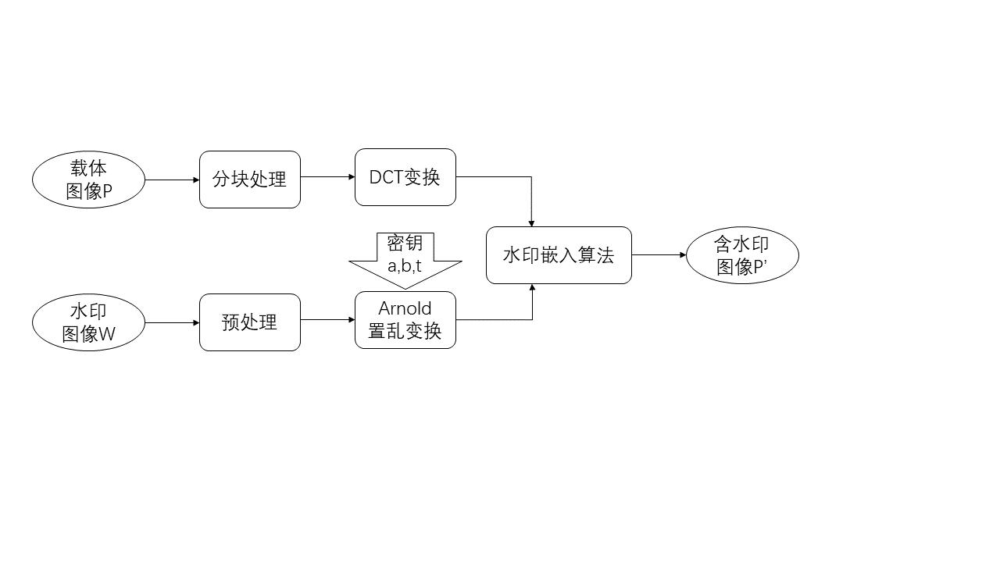
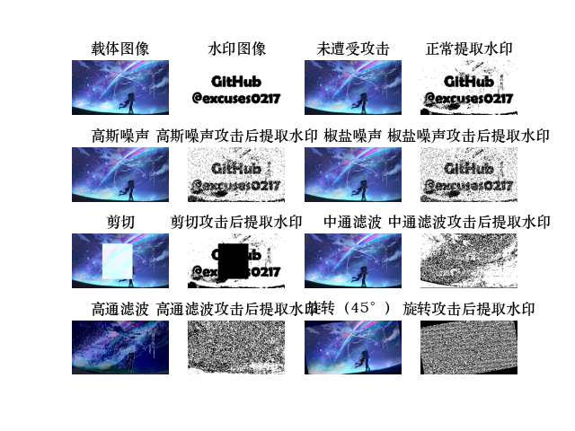

# dct_watermark
在本项目中，测试了一种数字盲水印算法，即基于DCT的图像水印算法。所谓盲水印，是指人感知不到的水印，包括看不到或听不见。其主要应用于音像作品、数字图书等，目的是，在不破坏原始作品的情况下，实现版权的防护与追踪。在正常图片传播下很难通过肉眼看见水印，当涉及到版权问题时即可将图片中水印通过公开算法提取出来，以保护版权信息。

本项目还对该算法进行了模拟以评估其性能，并开发并测试了一种基于Arnold 变换的改进的切割攻击算法。该算法还使用Arnold 变换参数作为密钥，以进一步保护嵌入的信息，减少信息泄露的风险。

选取1920×1080的RGB彩色电影壁纸（图3.1）作为载体图像，以及240×135的二值图像作为嵌入的水印图案

选取嵌入强度α=15，分块大小为8×8。嵌入水印后效果图如下：

提取出的水印如下

基于DCT的数字水印的中心思想就是通过DCT变换对图像块进行处理后，然后选择变换域中的一些系数值，再根据一些特定规则来将水印嵌入其中。当我们将载体图像DCT分块后，每一个图像块的DCT系数频值带分布由左上往右下的系数频率逐渐升高，所以选取一个适合的中频系数来做信息隐藏（水印）。由于图像块量化后能够将水印信息比较均匀地分布在图像的空间域内，整体水印效果较好，对图像的破坏性较小，仅在浅色与深色区域相比于原图有一些失真。

实验过程中计算在不同嵌入强度α下的峰值信噪比（PSNR）和结构相似性（SSIM），得到折线图如下所示。

在嵌入强度α分别为5、10、20的条件下，分别使用高斯噪声、椒盐噪声、高通滤波、剪切攻击、均值滤波和旋转攻击来处理嵌入水印后的图像

鲁棒性测试结果可知，该水印算法对于剪切攻击的抵抗性不是特别理想，剪切的随机因素过大，导致提取出的水印不具有普适性。下面实验一种结合Arnold 变换的改进水印算法，使其对剪切攻击具有良好的鲁棒性。

 

##### 算法描述

由Arnold变换矩阵形式可知，Arnold 置乱变换可以在一定的参数条件下，实现将图像的像素点在空间域上置乱。如果能将水印的有效像素点通过变换能够均匀的嵌入分布在载体图像上，那么即使通过剪切掉了一部分图案，也可以通过整幅含水印图像提取出较为完整的水印图案。

具体嵌入流程如下图所示：

相比于原始DCT水印算法，本改进算法将嵌入的水印先做Arnold 置乱变换，并依据置乱映射规则选择置乱系数                                、  和  作为密钥，将Arnold 置乱变换后的水印图像嵌入载体图像，得到含水印图像  。

